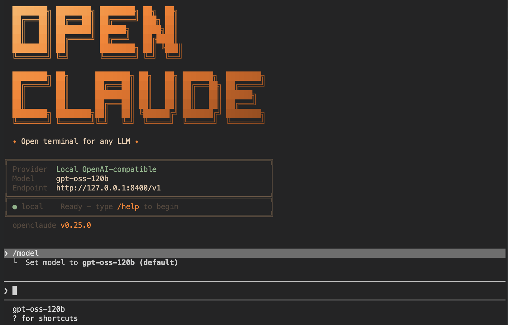

# furio — Furiosa RNGD NPU 위에서 도는 코딩 에이전트

터미널에서 `furio` 를 치면 Claude Code 같은 코딩 에이전트가 뜨고, 추론은 연구실의
Furiosa RNGD NPU 가 한다. 클라우드 API 키도, GPU 도 필요 없다.



구조는 셋이다.

| 폴더 | 무엇 | 누가 쓰나 |
|---|---|---|
| `client/` | `furio` 설치기(Linux·macOS·Windows), SSH 터널 도우미, 목 라우터 | 쓰는 사람 |
| `server/` | 모델을 요청 때 올리는 라우터(OpenAI 호환 `:8400`), furiosa-llm 파서 패치 | NPU 서버 운영자 |
| `openclaude-npu/` | 화면(openclaude)에 NPU 기능을 더한 패치 23개 | 클라이언트를 직접 빌드할 때 |

라우터는 **요청이 올 때 모델을 올린다**. 카드가 모자라면 오래 안 쓴 모델을 내리고 바꾼다.
그래서 모델 17종을 등록해 두고도 카드 4장으로 돌아간다. 모델 하나가 올라오는 데 최대 2분쯤
걸리고, 그동안 화면 상태줄의 LED 가 노랑 → 초록으로 바뀐다.

---

## 1. 쓰는 사람 — 설치

라우터 주소(`SDI_SERVER`)만 정해서 설치기를 한 번 돌리면 끝난다.

```bash
git clone https://github.com/SOTA-PNU/furio-openclaude.git
cd furio-openclaude

# 같은 LAN 안이라면 서버로 바로
SDI_SERVER=http://10.125.19.138:8400 bash client/install.sh
```

밖(집·외부망)에서는 SSH 터널을 먼저 연다. 터널 창은 켜 둔 채로 다른 터미널에서 쓴다.

```bash
# 터미널 ①  — 터널 (= ssh -p 10022 -N -L 8400:localhost:8400 사용자@서버)
SDI_SSH_USER=jun bash client/furio-connect.sh

# 터미널 ②  — 설치는 localhost 로
SDI_SERVER=http://127.0.0.1:8400 bash client/install.sh
```

Windows(PowerShell):

```powershell
$env:SDI_SERVER="http://127.0.0.1:8400"     # 터널을 먼저 연 경우
powershell -ExecutionPolicy Bypass -File client\install.ps1
```

서버가 인증을 켜 두었다면 설치·사용 모두에 키를 준다: `SDI_API_KEY=<키>`.

설치기는 `~/.furio` 에만 설치하고 전역 npm 을 건드리지 않는다. 지우려면 `rm -rf ~/.furio ~/.local/bin/furio`.

## 2. 쓰는 사람 — 사용

```bash
furio                          # 화면(TUI) 열기
furio -p "PROMPT.md 대로 base_run.py 를 고쳐 새 파일로 만들어줘"   # 한 줄 실행
furio --model Qwen3-32B-FP8    # 이번 실행만 다른 모델로
```

화면 안에서:

- `/model` — 모델과 tp·dp·pp(카드를 몇 장 어떻게 쓸지)를 고른다. 고르는 즉시 라우터가 올리기 시작한다.
- `Shift+Tab` — 권한 모드 순환: 매번 확인 → 편집 자동 → 계획 → 전부 자동.
- 상태줄 LED — 초록은 올라와 있음, 노랑은 올라오는 중, 빨강은 아직 카드에 없음.

기본 모델은 `gpt-oss-120b` 다(도구 호출·코드 작성 실측 확인). 도구 호출까지 확인한 모델은
`gpt-oss-120b`, `Solar-Open-100B`, `Qwen3-32B-FP8`, `Llama-3.3-70B-Instruct` 넷이다.
`Qwen3-Coder-30B-A3B-Instruct-FP8` 은 공식 아티팩트 자체가 긴 프롬프트에서 무너져
코딩 에이전트로는 쓰지 못한다(자세한 내용은 `server/README.md`).

### 자주 쓰는 옵션

설치할 때 주면 기본값으로 굳고, 실행할 때 주면 그 실행에만 적용된다.

| 변수 | 뜻 |
|---|---|
| `SDI_SERVER` | 라우터 주소 (설치 시 필수) |
| `SDI_API_KEY` | 인증이 켜진 서버에 붙을 때 |
| `FURIO_MODEL` | 기본 모델 (기본값 `gpt-oss-120b`) |
| `FURIO_AUTO` | 자동 실행: 빈값=매번 확인, `edits`=편집만, `safe`=규칙 기반, `1`=전부 자동 |
| `FURIO_MAX_TURNS` | 요청 하나가 쓸 도구 왕복 한도 (기본 50) |
| `FURIO_AGENTS=0` | 서브에이전트(Agent/Task) 끄기 — NPU 에선 위임 한 번에 메인 모델이 내려간다 |
| `FURIO_TOOLS` | 도구 축소 (예: `Bash,Edit,Read,Write,Glob,Grep`) — 작은 ctx 모델에서 여유가 생긴다 |
| `FURIO_CMD` / `FURIO_HOME` / `FURIO_BIN_DIR` | 명령 이름·설치 위치 바꾸기 |

```bash
# 예: 지켜보지 않고 돌릴 때 — 편집은 자동, 도구 왕복은 100 까지
FURIO_AUTO=edits FURIO_MAX_TURNS=100 furio -p "테스트 실패 원인을 찾아 고쳐줘"
```

## 3. NPU 없이 먼저 보기

서버에 못 붙는 PC 에서도 화면과 기능은 그대로 시험할 수 있다. 목 라우터는 실제 라우터와 같은
엔드포인트를 내고 모델이 올라오는 과정까지 흉내 낸다(추론은 하지 않고 고정 문구를 답한다).

```bash
python3 client/mock-router.py &                       # :8400
SDI_SERVER=http://127.0.0.1:8400 bash client/install.sh
furio
```

## 4. 서버 운영자 — 라우터 띄우기

필요한 것: RNGD 카드, `furiosa-llm` 이 설치된 파이썬 venv, 빌드해 둔 아티팩트.

```bash
FURIO_VENV=~/furiosa \
FURIO_ARTIFACTS=/mnt/nvme2n1p1/models/artifacts \
FURIO_CLIENT_DIST=/path/to/openclaude/dist \
bash server/serve-router.sh

curl -s localhost:8400/v1/models | python3 -m json.tool     # 등록된 모델
curl -s localhost:8400/router/status | python3 -m json.tool # 지금 카드에 올라온 모델
bash server/serve-router.sh stop                            # 라우터 + 백엔드 종료
```

키를 요구하려면 `SDI_API_KEY=<키> bash server/serve-router.sh` 로 띄운다.

`FURIO_CLIENT_DIST` 를 주면 라우터가 그 빌드 결과를 사용자에게 배포한다 — 사용자는
`install.sh` 만 돌리면 NPU 기능이 든 클라이언트를 받는다. 빌드 방법은 `openclaude-npu/README.md`.

Qwen3-Coder 계열을 쓰려면 furiosa-llm 에 도구 호출 파서를 넣는다:

```bash
bash server/furiosa_patches/install.sh      # qwen3_coder 파서 등록 (venv 안에 설치)
```

주요 환경변수: `FURIO_VENV`, `FURIOSA_LLM_BIN`, `FURIO_ARTIFACTS`, `FURIO_CLIENT_DIST`,
`FURIO_LOGDIR`, `SDI_API_KEY`, `ROUTER_READY_TIMEOUT`, `ROUTER_EVICT_WAIT`.

## 5. 요구 사항

- 쓰는 PC: **Node ≥ 22 또는 bun**. 설치기가 실행 때마다 골라 쓰므로 둘 중 하나만 있으면 된다.
  (Windows 설치기는 Node ≥ 22 만 지원한다.)
- 서버: RNGD 카드, `furiosa-llm`(2026.3.0 에서 확인), 파이썬 3.10+.

## 6. 막혔을 때

| 증상 | 조치 |
|---|---|
| `Error: Detected 18.x … requires Node.js >=22` | `nvm install 22` 또는 `curl -fsSL https://bun.sh/install \| bash` 후 설치기를 다시 돌린다 |
| `furio: command not found` | `~/.local/bin` 이 PATH 에 있는지 확인 (`export PATH="$HOME/.local/bin:$PATH"`) |
| `서버 도달 실패` | 라우터가 떠 있는지(`curl $SDI_SERVER/v1/models`), 터널 창이 살아 있는지 |
| `400 … exceeds model maximum context length` | `FURIO_MAX_OUTPUT` 를 낮추거나 ctx 가 큰 모델로 바꾼다 |
| 모델이 파일을 안 만들고 설명만 한다 | 도구 호출이 되는 모델인지 확인 — 위 네 모델 중에서 고른다 |

자세한 내용: 사용자용은 [`client/README.md`](client/README.md), 서버용은 [`server/README.md`](server/README.md).

## 라이선스·출처

화면은 [openclaude](https://github.com/Gitlawb/openclaude) 를 쓴다. openclaude 는 Anthropic 의
Claude Code CLI 파생이며, 그 고지를 [`NOTICE`](NOTICE) 에 그대로 실었다. 이 저장소가 담은
우리 작업물(설치기·라우터·NPU 패치)은 부산대 SOTA 연구실이 만들었고 같은 조건으로 제공한다.
openclaude 본체 소스는 이 저장소에 없다 — 설치기가 npm 에서 받는다.
